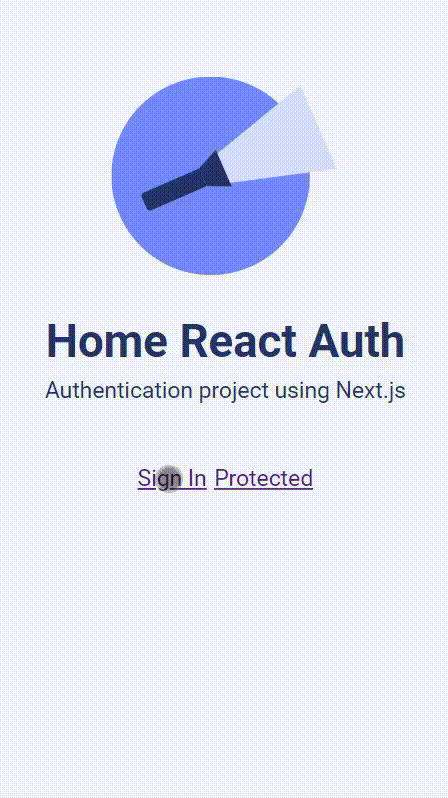

<h1 align="center">
  
  <br>
React Authentication</h1>

<p align="center">Auth app with login/logout and user validation</p>

<p align="center">
 <a href="#about">About</a> •
 <a href="#getting-started">Getting Started</a> •
 <a href="#study-topics">Study Topics</a> •
 <a href="#features">Features</a> • 
 <a href="#tech-stack">Tech Stack</a> • 
 <a href="#tech-stack">Tech Stack</a>
</p>

<p align="center">
  <kbd>
    
  </kbd>
</p>

## About

This project was created for study purposes. The goals are to improve react hook concepts,localstorage management, and form validation.

---

## Getting started

### 1. Clone the repository and install dependancies

```
git clone https://github.com/MaxwelSantana/react-auth
cd react-auth
npm i
```

### 2. Configure your local environment

Copy the .env.local.example file in this directory to .env.local (which will be ignored by Git):

```
cp .env.local.example .env.local
```

Add details for one or more providers (e.g. Google, Twitter, GitHub, Email, etc).

### 3. Start the application

To run your site locally, use:

```
npm run dev
```

To run it it production mode, use:

```
npm build
npm start
```
---

## Study Topics

- [x]  Next.Js Page Routes
- [x]  Authentication with multiple providers with Next Auth
- [x]  Custom Login Page
- [x]  Protected pages

## Features
- [x]  The system should allow logging in with social networks
- [x]  The system should allow logging in by email

---

## Tech Stack

-   [React](https://reactjs.org/)
-   [Next.js](https://nextjs.org/)
-   [NextAuth.js](https://next-auth.js.org/)
-   [Sqlite3](https://www.sqlite.org/index.html)
