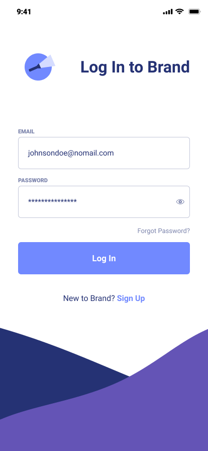

<h1 align="center">React Authentication</h1>

Auth app with login/logout and user validation

 <a href="#about">About</a> •
 <a href="#features">Features</a> •
 <a href="#layout">Layout</a> • 
 <a href="#how-it-works">How it works</a> • 
 <a href="#tech-stack">Tech Stack</a> • 
 <a href="#contributors">Contributors</a> • 
 <a href="#author">Author</a> • 
 <a href="#user-content-license">License</a>

<h4 align="center"> 
	🚧  React Authentication 🚀 Em construção...  🚧
</h4>

## About

This project was created for study purposes. The goals are to improve react hook concepts,localstorage management, and form validation.

---

## Tópicos de Estudos

- [x]  Next.Js Page Routes
- [x]  Authentication with multiple providers with Next Auth
- [x]  Custom Login Page
- [x]  Protected pages

## Features
- [x]  The system should allow logging in with social networks
- [x]  The system should allow logging in by email

---

## Layout

  

---

## :zap: **Tech Stack**